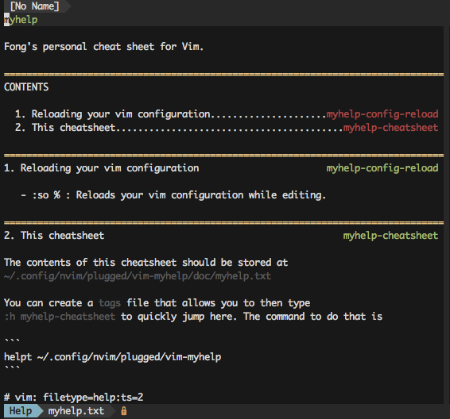

# Fong's Vim Cheatsheet

This is my personal Vim cheatsheet. The idea for this was 
[original from technosophos](https://github.com/technosophos/vim-myhelp). For 
more information, see my blog post ["Making Your Personal VIM Cheatsheet](http://tinyheero.github.io/2017/11/04/vim-cheatsheet.html).

## How to install

The cheatsheet gets added as a plugin. So if you use a plugin manager like 
[vim-plug](https://github.com/junegunn/vim-plug), you can add the following to 
your `~/.vimrc` or `~/.config/nvim/init.vim` (depending on whether you use Vim
or Neovim).

```
Plug 'tinyheero/vim-myhelp'
```

Install the plugin `:PlugInstall` and then you should be able to type 
`:h myhelp` and the following should appear:



## Editing the cheatsheet

The contents of the cheetsheet are located in `doc/myhelp.txt`. You can edit 
this file to include new content. If you add new tags, you will have to 
generate a new tags file using the command:

```
helpt ~/.config/nvim/plugged/vim-myhelp
```

If you are using normal vim, you will need to find where the plugin gets 
installed and replace the above path with the correct path.
